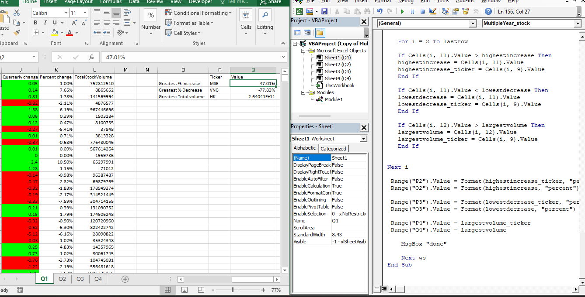
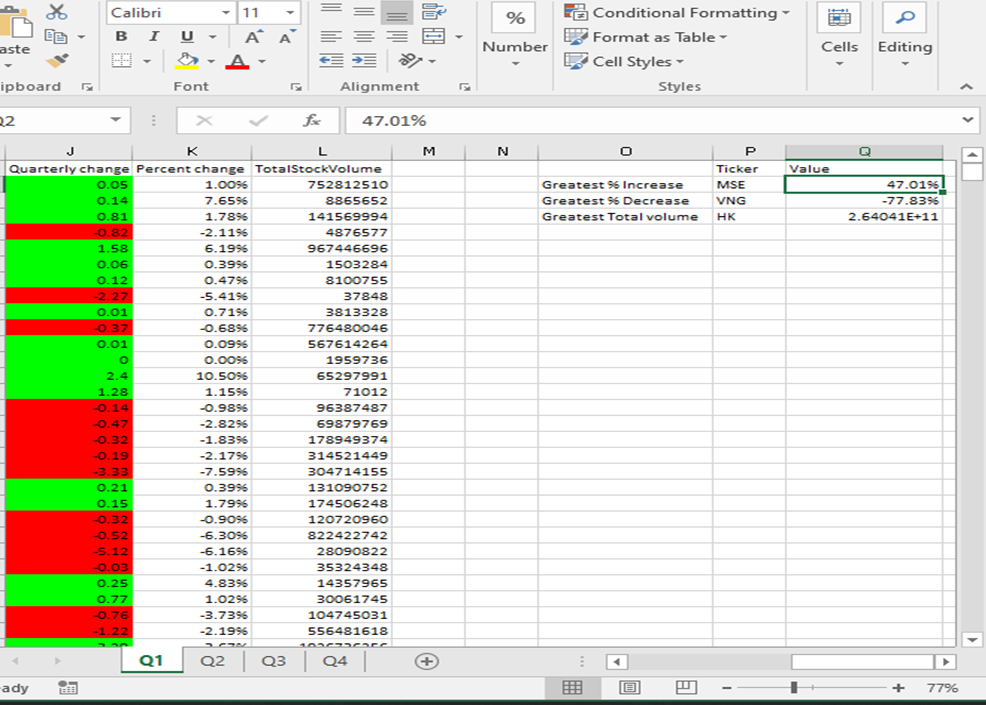

# VBA CHALLENGE
A VBA script to annalyze stock market data in a Microsoft Excel Workbook

## Name
 A Multiple quarterly Year stock tickers, open, high, loe, close  with total volume

## Description
A Multiple stock  tickers in an Excel Workbook with  the 4 quarter sheets, for each quarter of the year, that calculates the Quarterly change of every ticker as the last closing, the percentage change of the ticker at the end of closing,  the total volume of the ticker, the highest value for the ticker with the greatest total volume and the gretaest highest and lowest ticker with it's value.

Conditional formatted Quarterly change for positive change to be green and negative change to be red.
Loop through all the worksheet, Q1, Q2, Q3, Q4

## testing
i ran my script on an Excel Workbook(Multiple_Year_stock_data.xlsx)
i used windows 10, Microsoft 365. make sure it is in this environment

## Visuals
conditional format to look like this:

 This Code RUNS the RESULTS FOR:

this output:

## Installation
Make sure you have an Microsoft 365 - Excel installed. 

## Usage
1.You can find excel file under VBA Challenge 
2.After downloading excel file, open multiple_year_stock-data
3.On the excel tab, open developer, click on visual basic editor
4. run the multiple_year_stock.vba for the vba code
5. should be able to loop through all worksheets
 Results should match images provided

 {Remove any existing conditional formatting in Column J (Quarterly Change)
        ws.Range("K2:K" & lastrow).FormatConditions.Delete}

        the conditional format from the Quarterly change was getting extended to percent change, hence formatConditions.Delete
        for any formatting in column K
(referenced from Chatgpt)
