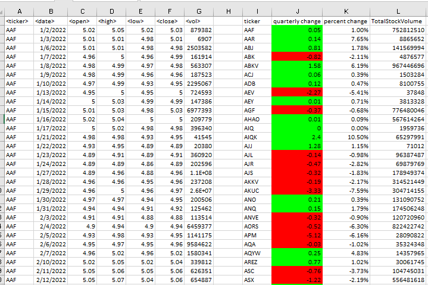

# VBA CHALLENGE
A VBA script to annalyze stock market data in a Microsoft Excel Workbook

## Name
 A Multiple quarterly Year stock tickers, open, high, loe, close  with total volume

## Description
A Multiple stock  tickers in an Excel Workbook with  the 4 quarter sheets, for each quarter of the year, that calculates the Quarterly change of every ticker as the last closing, the percentage change of the ticker at the end of closing,  the total volume of the ticker, the highest value for the ticker with the greatest total volume and the gretaest highest and lowest ticker with it's value.

Conditional formatted Quarterly change for positive change to be green and negative change to be red.
Loop through all the worksheet, Q1, Q2, Q3, Q4

## testing
i ran my script on an Excel Workbook(Multiple_Year_stock_data.xlsx)
i used windows 10, Microsoft 365. make sure it is in this environment

## Visuals
conditional format to look like this:

## Installation
Make sure you have an Microsoft 365 - Excel installed. 

## Usage
you can find excel file under VBA Challenge 
after downloading excel file, open multiple_year_stock-data
on the excel tab, open developer, click on visual basic editor

## License
 i dont think it is licensed.

## Project status
Sstill currrently working on it.